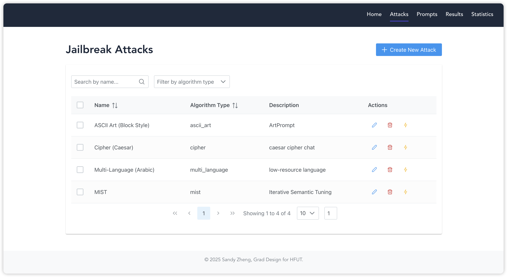
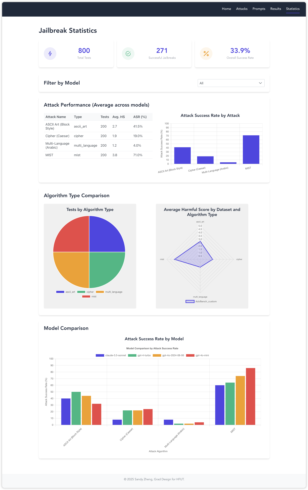

# 😈 Jailbreak System

A platform for testing, evaluating, and analyzing jailbreak attacks against large language models. This system provides tools and interfaces for users to assess the robustness of **closed-source** language models against various attack strategies.

## 🐱 Project Overview

The Jailbreak System consists of three main components:

1. **Frontend**: A React-based web interface for interacting with the system
2. **Backend**: A Flask API server handling the core logic and model interactions
3. **Database**: Stores attack patterns, prompts, and results

## 🦾 Updates

04/25/2025: Enables real LLM APIs (gpt-4o-mini, gpt-4o-2024-0806, gpt-4-turbo, claude-3.5-sonnet)

05/08/2025: Optimized evaluation logic (Harmful Score >= 4 -> Success)

05/10/2025: Implemented our own algorithm **MIST**!

## 🙌 Demo

### Homepage


### Attacks Page



### Prompts Page


### Results Page


### Result Details


### Statistics Page



## ✳️ Features

- Create and manage jailbreak attacks
- Test attacks against various language models
- Analyze attack success rates and patterns
- Categorize and organize prompts
- Visualize attack results
- Implement custom attack algorithms

## ✅ Supported Attack Algorithms

The system incorporates the following algorithms:

1. **Multi-language**: Uses low-resource language to bypass restrictions. Please refer to [NeuraIPS'23Workshop-LRL](https://arxiv.org/pdf/2310.02446)
2. **ASCII Art**: Encodes sensitive words using ASCII art, built upon [ACL'24-ArtPrompt](https://github.com/uw-nsl/ArtPrompt)
3. **Cipher**: Uses various cryptographic encoding methods to bypass content moderation, built upon [ICLR'24-CipherChat](https://github.com/RobustNLP/CipherChat)
4. **MIST**: Our own jailbreak algorithm!! Please refer to [mist_optimizer.py](backend/utils/mist_optimizer.py)

## 🛖 Structure

```
JailbreakSystem/
├── frontend/          # React-based web interface
└── backend/          # Flask API server (includes database)
```

## 🔛 Getting Started

1. Clone the repository:

```bash
git clone https://github.com/SandyyyZheng/JailbreakSystem.git
cd JailbreakSystem
```

2. For documentations, see: 

- [Frontend](frontend/README.md)
- [Backend](backend/README.md)

## 📖 License

This project is under the [MIT license](LICENSE).

## 👻 Acknowledgments

- [Deepbricks](https://deepbricks.ai) for providing the APIs
- 2025 Graduate Design for HFUT
- Advised by Prof. Yuanzhi Yao. My deepest thanks to Dr. Yao for all the encouragement and support along the way 🥺
- Relies **heavily** on [Cursor](https://www.cursor.com/) (mainly claude-3.5-sonnet & claude-3.7-sonnet) to construct framework and fix bugs. Kudos to AI🤖!
